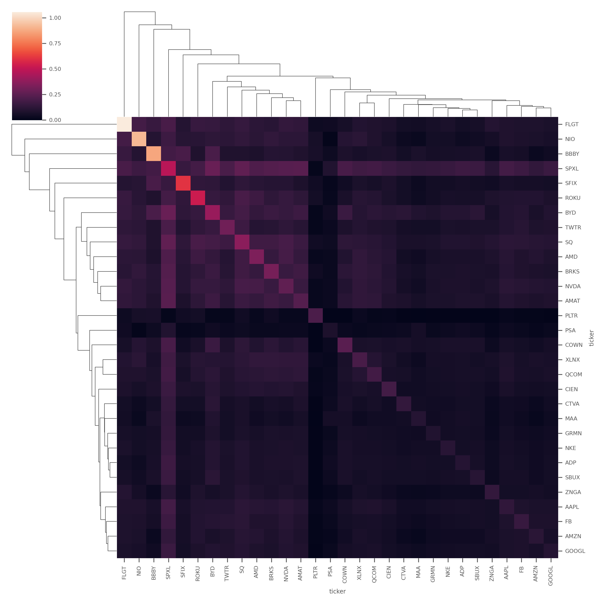

# Introduction

## Description


A stock screener that can analyze your Wealthsimple (or custom) watchlist and recommend an optimized portfolio of stocks to a Telegram channel. It implements portfolio optimization methods, including classic General Efficient Frontier techniques, covariance shrinkage using Ledoit-Wolf etc. Future versions to include Black-Litterman Allocation, configurable objectives etc.

## Process

The selection process involves two key steps:

1. Pre-selection of watchlist stocks (based on Trading View 1 Week Interval technical analysis based recommendations) to assess an active Buy signal.
    1. Trading View uses an ensemble of Lagging Indicators (Moving Averages) and Leading Indicators (Oscillators) to summarize the final recommendation.
    2. [Sample: TSLA](https://www.tradingview.com/symbols/NASDAQ-TSLA/technicals/)
2. Portfolio Optimization (based on Efficient Frontier techniques) for an investment value.

## Sample

Ticker Trends:


Efficient Frontier:


Covariance Matrix:


Covariance Matrix (Cluster Map):


## Run

```sh
python -m venv .venv
source .venv/bin/activate
pip install -r requirements.txt
python app.py
```

## Curl samples

```bash
curl --request POST --url https://api.telegram.org/bot$TELEGRAM_TOKEN/setWebhook --header 'content-type: application/json' --data '{"url": "https://2j48cpk83h.execute-api.us-east-1.amazonaws.com/dev"}'
#https://api.telegram.org/bot$TELEGRAM_TOKEN/getWebhookInfo
```

## Environment Variables

Must have a `*.env` with the following variables for full functionality:

```sh
TELEGRAM_TOKEN=XXX
TELEGRAM_ID=XXX
WEALTHSIMPLE_USERNAME=XXX
WEALTHSIMPLE_PASSWORD=XXX
```
