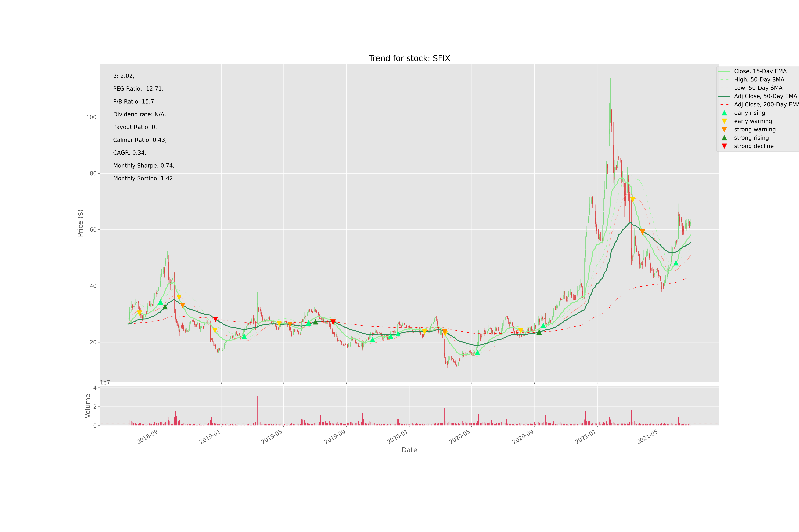
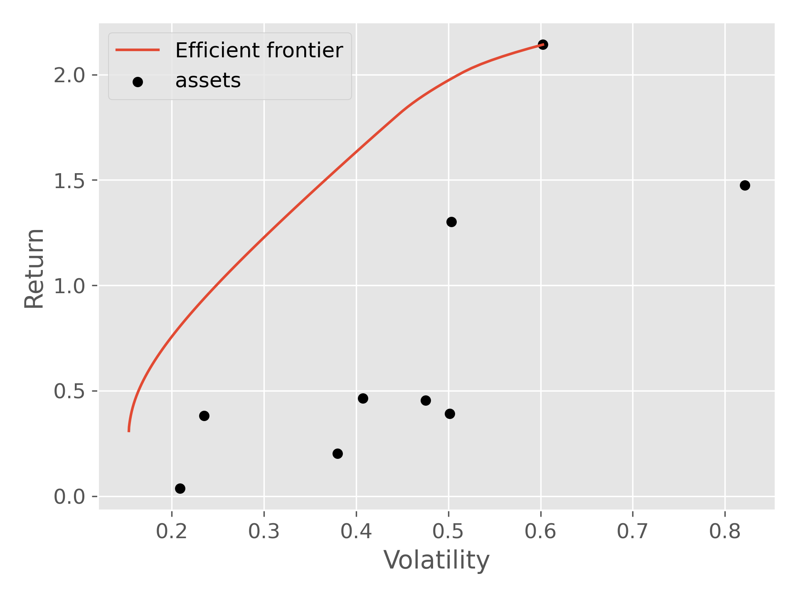
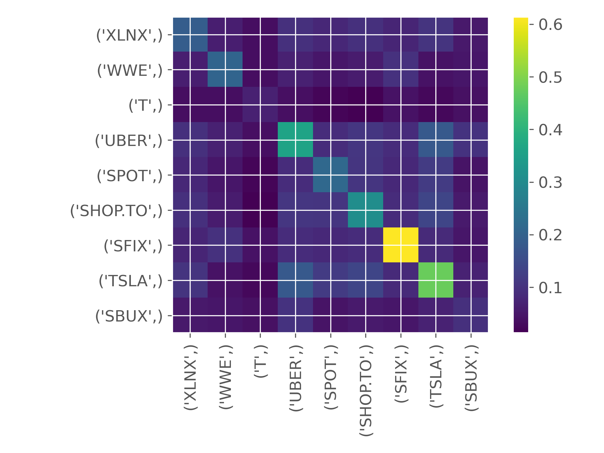

# Introduction

## Description


A stock screener that can analyze your watchlist and send recommended stocks to a telegram channel.

## Features

1. Technical Analysis for stocks (based on Moving Average Crossovers)
2. Portfolio Optimization (based on Efficient Frontier)

## Sample





## Curl samples

```bash
curl --request POST --url https://api.telegram.org/bot$TELEGRAM_TOKEN/setWebhook --header 'content-type: application/json' --data '{"url": "https://2j48cpk83h.execute-api.us-east-1.amazonaws.com/dev"}'
#https://api.telegram.org/bot$TELEGRAM_TOKEN/getWebhookInfo
```
