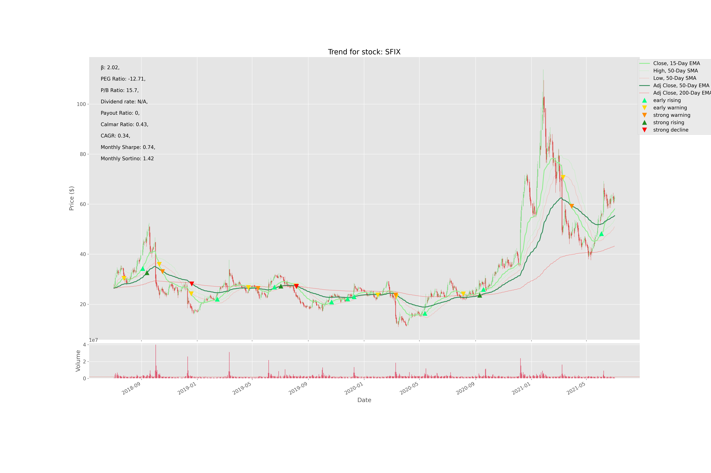
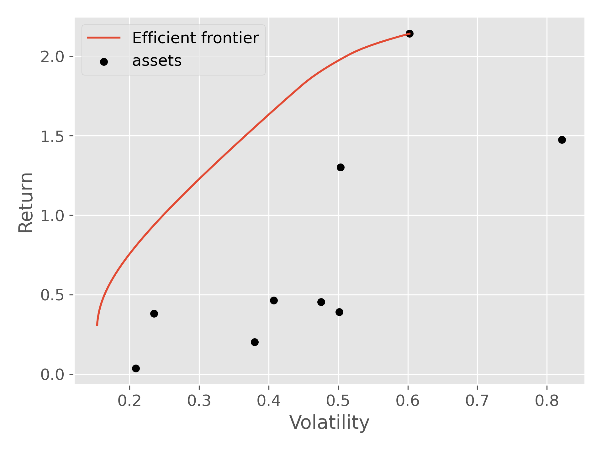
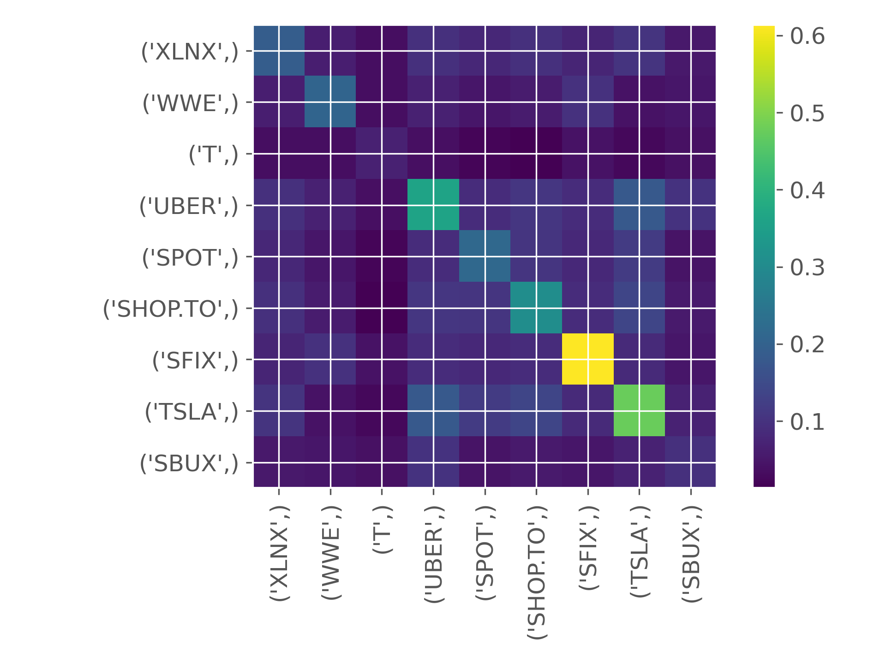
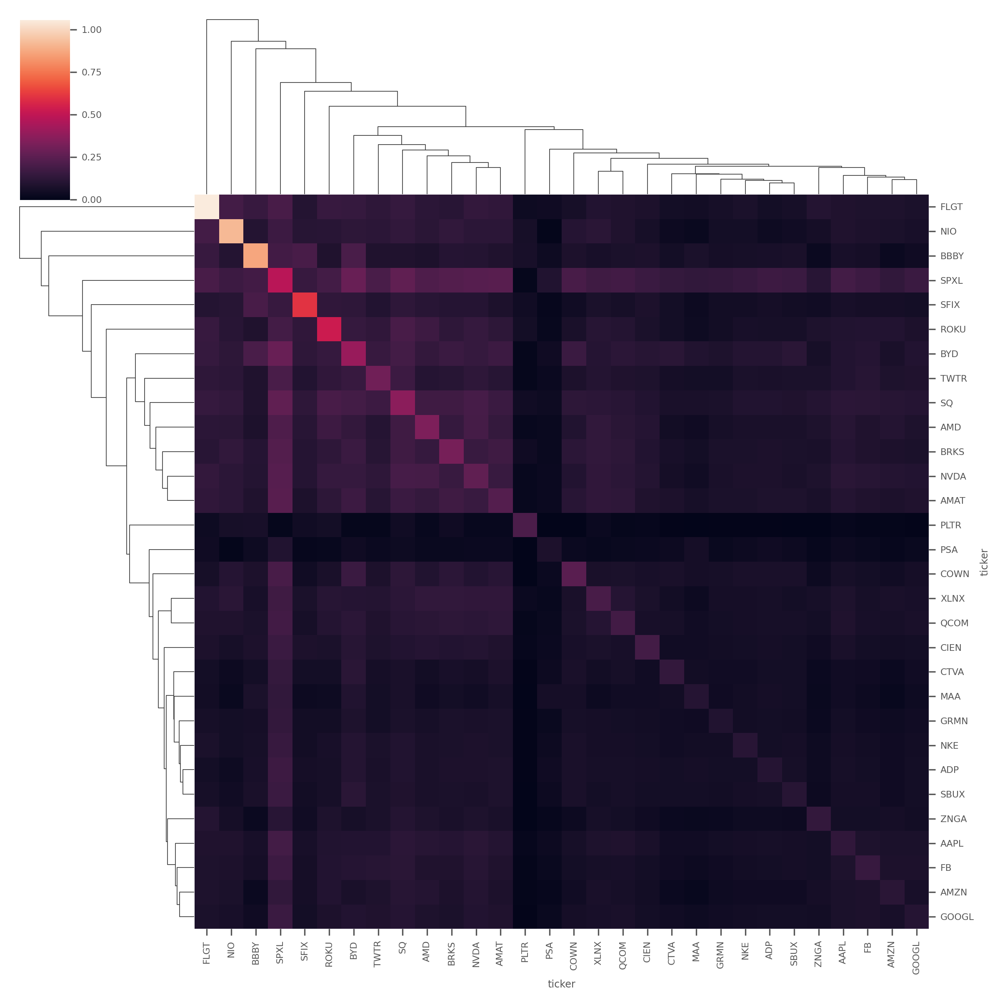

# Introduction

## Description


A stock screener that can analyze your Wealthsimple (or custom) watchlist and recommend an optimized portfolio of stocks to a Telegram channel. It implements portfolio optimization methods, including classic General Efficient Frontier techniques, covariance shrinkage using Ledoit-Wolf etc. Future versions to include Black-Litterman Allocation, configurable objectives etc.

## Process

The selection process involves two key steps:

1. Pre-selection of watchlist stocks (based on Trading View 1 Week Interval technical analysis based recommendations) to assess an active Buy signal.
    1. Trading View uses an ensemble of Lagging Indicators (Moving Averages) and Leading Indicators (Oscillators) to summarize the final recommendation.
    2. [Sample: TSLA](https://www.tradingview.com/symbols/NASDAQ-TSLA/technicals/)
2. Portfolio Optimization (based on Efficient Frontier techniques) for an investment value.


## Sample

Ticker Trends:


Efficient Frontier:


Covariance Matrix:


Covariance Matrix (Cluster Map):


## Quick Start (TL;DR)

```bash
# 1. Setup environment
curl -LsSf https://astral.sh/uv/install.sh | sh  # Install uv
uv venv --python 3.11
source .venv/bin/activate
uv pip install -r requirements.txt

# 2. Configure (create .env from .env.example and add your credentials)
cp .env.example .env
nano .env  # or vim, code, etc.

# 3. Run
python app.py --port 8000

# 4. Open browser → http://localhost:8000
```

## Setup & Run

### Prerequisites
- [uv](https://docs.astral.sh/uv/getting-started/installation/) (recommended)
- Python 3.11+ (required for numpy 2.x and pandas 2.x)

### Installation
```sh
# Install uv if not already installed
curl -LsSf https://astral.sh/uv/install.sh | sh

# Create virtual environment with Python 3.11
uv venv --python 3.11

# Activate virtual environment
source .venv/bin/activate

# Install dependencies
uv pip install -r requirements.txt

# Create .env file with required variables (see .env.example)
```

### Run


#### Terminal/CLI Usage
```sh
# Activate the virtual environment
source .venv/bin/activate

# Run on default port (8000)
python app.py

# Or specify a custom port
python app.py --port 8000

# Run in background
python app.py --port 8000 > app.log 2>&1 &

# View logs (if running in background)
tail -f app.log
```

Access the web interface at: **http://localhost:8000** (or your chosen port)

---

## 🆕 New Features - Test Commands

### 1. Sell Signal Analysis

**Analyze your entire portfolio from CSV** (`data/inputs/my_stocks.csv`):

```sh
curl -X POST http://localhost:8000/check_sells/ \
  -H "Content-Type: application/json" \
  -d '{}'
```

**Signals detected:**
- **Stop-loss**: Price drops >12% below entry
- **Trailing stop**: ATR-based (20-day high - 3×ATR)
- **Technical breakdown**: Death cross + RSI<30 + MACD bearish
- **Fundamental issues**: Earnings decline, low ROE, high debt, overvalued

**Priority levels:**
- **HIGH**: Stop-loss hit or losing positions → SELL NOW
- **MEDIUM**: Winners >25% (trim profits) or fundamental issues → REVIEW/TRIM
- **LOW**: No issues → HOLD

Results sorted by severity (worst losses first for HIGH priority).

**Or analyze specific holdings:**

```sh
curl -X POST http://localhost:8000/check_sells/ \
  -H "Content-Type: application/json" \
  -d '{
    "holdings": [
      {"symbol": "AAPL", "entry_price": 250, "shares": 10},
      {"symbol": "TSLA", "entry_price": 400, "shares": 5}
    ]
  }'
```

### 2. Portfolio Risk Check
Check position limits, concentration risk, and rebalancing needs:

```sh
curl -X POST http://localhost:8000/check_portfolio/ \
  -H "Content-Type: application/json" \
  -d '{
    "current_portfolio": {"AAPL": 0.35, "MSFT": 0.25, "GOOGL": 0.20, "TSLA": 0.20},
    "target_portfolio": {"AAPL": 0.30, "MSFT": 0.25, "GOOGL": 0.25, "TSLA": 0.20}
  }'
```

### 3. Advanced Optimization Methods

Try different optimization strategies:

```sh
# Minimum Volatility (lowest risk)
curl -X POST http://localhost:8000/recommend_stocks/ \
  -H "Content-Type: application/json" \
  -d '{"method": "min_vol", "budget": 10000}'

# Hierarchical Risk Parity (best diversification)
curl -X POST http://localhost:8000/recommend_stocks/ \
  -H "Content-Type: application/json" \
  -d '{"method": "hrp", "budget": 10000}'

# CVaR - Tail Risk Optimization
curl -X POST http://localhost:8000/recommend_stocks/ \
  -H "Content-Type: application/json" \
  -d '{"method": "cvar", "budget": 10000}'
```

**Available Methods:**

| Method | Description | Best For | Risk Level |
|--------|-------------|----------|------------|
| `max_sharpe` | Maximum Sharpe ratio | Best risk-adjusted returns | Medium |
| `min_vol` | Minimum volatility | Lowest risk portfolio | Low |
| `hrp` | Hierarchical Risk Parity | Best diversification | Medium |
| `cvar` | Conditional Value at Risk | Tail risk protection | Medium-Low |
| `semivariance` | Downside risk optimization | Downside protection | Medium |

### 4. Backtesting
Test historical performance of a portfolio:

```sh
curl -X POST http://localhost:8000/backtest/ \
  -H "Content-Type: application/json" \
  -d '{
    "tickers": ["AAPL", "MSFT", "GOOGL"],
    "weights": {"AAPL": 0.4, "MSFT": 0.35, "GOOGL": 0.25},
    "start_date": "2022-01-01",
    "initial_capital": 10000,
    "rebalance_freq": "monthly"
  }'
```

### 5. Compare Optimization Methods
Compare multiple methods side-by-side:

```sh
curl -X POST http://localhost:8000/compare_methods/ \
  -H "Content-Type: application/json" \
  -d '{
    "tickers": ["AAPL", "MSFT", "GOOGL", "NVDA"],
    "methods": ["max_sharpe", "min_vol", "hrp"]
  }'
```

---

## Terminal/CLI Usage

### Basic Operations

```sh
# Start the app (runs on http://localhost:8000)
source .venv/bin/activate
python app.py

# Custom port
python app.py --port 8080

# Background mode
python app.py --port 8000 > app.log 2>&1 &

# Check if app is running
curl http://localhost:8000/

# View logs (if running in background)
tail -f app.log

# Stop background process
pkill -f "python.*app.py"
```

### API Testing with curl

#### Watchlist Management
```sh
# Get all symbols in watchlist
curl http://localhost:8000/watchlist/

# Add a stock symbol
curl -X POST http://localhost:8000/watchlist/add \
  -H "Content-Type: application/json" \
  -d '{"symbol": "AAPL"}'

# Add multiple stocks
for symbol in MSFT GOOGL NVDA TSLA; do
  curl -X POST http://localhost:8000/watchlist/add \
    -H "Content-Type: application/json" \
    -d "{\"symbol\": \"$symbol\"}"
done

# Remove a stock
curl -X POST http://localhost:8000/watchlist/remove \
  -H "Content-Type: application/json" \
  -d '{"symbol": "AAPL"}'

# Clear entire watchlist
curl -X POST http://localhost:8000/watchlist/clear
```

#### Portfolio Optimization
```sh
# Run portfolio analysis with default settings
curl -X POST http://localhost:8000/recommend_stocks/ \
  -H "Content-Type: application/json" \
  -d '{
    "threshold": 0.05,
    "budget": 10000,
    "method": "max_sharpe"
  }'

# Use semivariance method (downside risk optimization)
curl -X POST http://localhost:8000/recommend_stocks/ \
  -H "Content-Type: application/json" \
  -d '{
    "threshold": 0.01,
    "budget": 25000,
    "method": "semivariance"
  }'

# Save results to file
curl -X POST http://localhost:8000/recommend_stocks/ \
  -H "Content-Type: application/json" \
  -d '{"threshold": 0.05, "budget": 10000, "method": "max_sharpe"}' \
  -o portfolio_results.json

# View results
cat portfolio_results.json | python -m json.tool
```

#### Import/Export Watchlist
```sh
# Export current watchlist to CSV
curl http://localhost:8000/watchlist/export -o my_watchlist.csv

# Import watchlist from CSV
curl -X POST http://localhost:8000/watchlist/import \
  -H "Content-Type: application/json" \
  -d "{\"csv_content\": \"$(cat my_watchlist.csv)\"}"
```

### Telegram Bot Setup (Optional)
```sh
# Set webhook for Telegram bot
curl --request POST \
  --url https://api.telegram.org/bot$TELEGRAM_TOKEN/setWebhook \
  --header 'content-type: application/json' \
  --data '{"url": "https://your-domain.com/webhook"}'

# Check webhook info
curl https://api.telegram.org/bot$TELEGRAM_TOKEN/getWebhookInfo
```

## Optimization Methods Available

| Method | Description | Best For | Risk Level |
|--------|-------------|----------|------------|
| `max_sharpe` | Maximum Sharpe ratio | Best risk-adjusted returns | Medium |
| `min_vol` | Minimum volatility | Lowest risk portfolio | Low |
| `hrp` | Hierarchical Risk Parity | Best diversification | Medium |
| `cvar` | Conditional Value at Risk | Tail risk protection (95%) | Medium-Low |
| `semivariance` | Downside risk optimization | Downside protection | Medium |

## Environment Variables

Must have a `*.env` with the following variables for full functionality:

```sh
TELEGRAM_TOKEN=XXX
TELEGRAM_ID=XXX
WEALTHSIMPLE_USERNAME=XXX
WEALTHSIMPLE_PASSWORD=XXX
```

Note: Wealthsimple has an added layer of security with an OTP (One Time Password) that you'll need to enter in the terminal everytime you run the application.

## API Endpoints

### Portfolio Optimization
- `POST /recommend_stocks/` - Optimize portfolio with multiple methods
  - Parameters: `method`, `budget`, `threshold`
  - Methods: `max_sharpe`, `min_vol`, `hrp`, `cvar`, `semivariance`

### Sell Signals (New)
- `POST /check_sells/` - Analyze holdings for sell signals
  - Detects: Stop-loss, trailing stops, technical breakdowns, fundamental issues
- `POST /check_portfolio/` - Check portfolio-level risks
  - Checks: Position limits, concentration, rebalancing needs

### Backtesting (New)
- `POST /backtest/` - Backtest a portfolio allocation
  - Returns: Total return, Sharpe, Sortino, max drawdown, equity curve
- `POST /compare_methods/` - Compare optimization methods
  - Returns: Side-by-side performance comparison

### Watchlist Management
- `GET /watchlist/` - Get all symbols
- `POST /watchlist/add` - Add symbol
- `POST /watchlist/remove` - Remove symbol
- `POST /watchlist/clear` - Clear watchlist
- `POST /watchlist/import` - Import from CSV
- `GET /watchlist/export` - Export to CSV